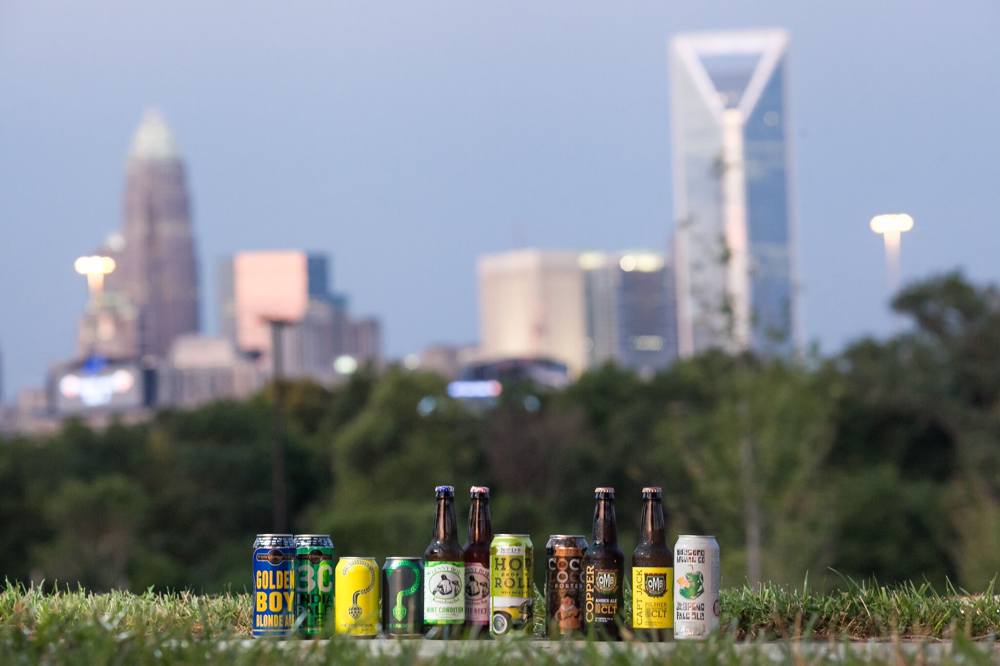

```{r global_options, include=FALSE}
knitr::opts_chunk$set(fig.width=12, fig.height=8, fig.path='Figs/',
                      echo=TRUE, warning=FALSE, message=FALSE)
```

Photograph by Eric Gaddy with [Casting Shadows Photography](http://castingshadowsphotography.com/)

### Introduction

Charlotte, North Carolina: home of NASCAR, barbeque, banking and ... craft beer? 

Over the last five years, a number of breweries have sprung up in Charlotte and already it's hard to keep up with the new names. Last summer, a [Fortune article](http://fortune.com/2015/07/25/craft-breweries-north-carolina/) covered Charlotte's growth into the craft beer industry, even calling Charlotte a hub for craft beer. While the same could be said for many other cities in the United States, in this tutorial we're going to explore ways to analyze Charlotte's growth into craft beer with Twitter data.

In this three-part tutorial, We will explore beer-related Tweets from Charlotte between Dec 2015 to Feb 2016 based on data from [Gnip's Historical PowerTrack API](http://support.gnip.com/apis/historical_api/). Tweets are identified in Charlotte based on geo-location (GPS coordinates); therefore, this analysis excludes Tweets without geo-location.

The purpose of these posts are to be tutorials for UNC Charlotte social scientists on ways to analyze Twitter data. While I find some neat results, these posts are not to be definitive analyses of the Charlotte's beer industry and since our data is limited to only geo-located Tweets, we cannot generalize our results to all Tweets.

The data and funding for this tutorial is provided through UNC Charlotte's [Data Science Initiative](http://dsi.uncc.edu) in collaboration with [Project Mosaic](http://projectmosaic.uncc.edu), the university's social science research initiative. 

For these tutorials, I'm using [R](http://www.r-project.org), which is a widely popular open-source statistical and graphic computing software. Through the tutorial, I'll overlay R code blocks and output like this:

```{r}
2 + 3
```

If you're new to R, don't stress over each line of code. For brevity, I'm not going to explain all of the functions and R language. Most of the code shown will be basic data manipulation with some pre-created functions I made to minimize the amount of code. For those interested in R data manipulations (data frames), here's a great [reference](https://www.datacamp.com/community/tutorials/15-easy-solutions-data-frame-problems-r). Nevertheless, my secondary goal is to introduce R to new users and show how powerful a few lines of code can be!

The code and data can be found on my [GitHub page](https://github.com/wesslen/CLTBeerTwitter). This tutorial was based on materials provided by [Pablo Barber&aacute;](http://pablobarbera.com/). His references are phenomenal and I highly recommend his [GitHub](https://github.com/pablobarbera/) page for a ton of great tutorials and references.

### Setup steps

Let's load our Charlotte Beer Twitter dataset using the `read.csv` function.

```{r}
beer.tweets <- read.csv("../datasets/CLT_beer_tweets.csv", encoding = "UTF-8", 
                        stringsAsFactors = FALSE)
```

First, how many Tweets do we have?

```{r}
nrow(beer.tweets)
```

What is the range of dates for the Tweets?

```{r}
# first Tweet
min(beer.tweets$postedTime)

# last Tweet
max(beer.tweets$postedTime)
```

The first Tweet was on Nov 30, 2015 at 7:41pm (Eastern time) and the last Tweet was on Feb 29, 2016 at 6:50pm (Eastern time).

And what are the columns (variables) in the dataset?

```{r}
colnames(beer.tweets)
```

This dataset includes 18 variables. The data includes details about the Tweet and its author.

Here's a brief metadata table that explains key variables that we'll use in our analysis:

Column        | Description                   | Category      |
------------- | ----------------------------- | ------------- |
body          | Tweet content/text            | Tweet         |
postedTime    | Time of Tweet                 | Tweet         |
displayName   | Twitter Username              | User          |
summary       | Twitter profile description   | User          |
friendsCount  | User's friends count          | User          |
followersCount| User's followers count        | User          |
statusesCount | User's Tweet count            | User          |
actor.location| User's self-reported location | User          | 
generator     | Mobile device or app used     | Device        |
geo.type      | Geo Type: Point or Polygon    | Geo-location  |
point_lat     | Point Latitude                | Geo-location  |
point_long    | Point Longitude               | Geo-location  |

Now, let's run pre-created functions in the `functions.R` file. 

Like a library, the `source` function runs these functions so that we can use them.

```{r}
source('../functions.R')
```

### Time

First, let's plot the daily count of Tweets along with a smoothing line, then we'll ask some questions designed to help interpret the data. These interactive graphs are created using [Plotly](https://plot.ly/).

```{r fig.height=6.5}
timePlotly(beer.tweets)
```
What are the spikes? 

- Answer: The weekend.

And, why was there a drop in late December? 

- Answer: The Christmas holiday! 

Wondering why there was a weak turnout around the January 22-23 weekend? 

- Answer: Because it snowed that weekend and, of course, even Charlotte bars shut down for an inch of snow.

But are there other time patterns -- like daily or hourly?

Next, let's create a box-plot for day of week and a line plot for hour to examine.

```{r fig.height=6.5}
weekPlotly(beer.tweets)
```
This plot shows how Tweets vary by the day of the week.

The weekend makes a difference. On average, there were about 90 geo-located point Tweets on Saturdays. Friday and Sundays average about 50-60 beer Tweets, but have some variability.

On the other hand, Mondays are the slowest beer day, averaging about 20 beer-Tweets per day. This isn't completely surprising as a handful of bars and breweries are closed on Mondays. The middle of the week (Tues-Thurs) are flat, about 40-50 beer-Tweets per day, with some variability for Wednesdays and Thursdays.

So no surprises: the weekends are beer time!

What about an hourly plot?

```{r fig.height=6.5}
hourPlotly(beer.tweets)
```
For this plot, we plot the Tweets by hour of the day (using a 24 hour clock). Try clicking on one of the days' names in the legend. It filters out the selected day.

Filter out Monday to Wednesday. Saturdays, Tweets start coming in around 11am through the night. Sundays, Tweets start at 12 but fall off around 8pm.

It's clear that time is an important factor in the number of Tweets. Let's now explore location as measured through GPS data: geo-location.

### Geo-location

Twitter’s location data falls into three categories ("3 P's"): points, polygons and profile locations. 

These location types can be divided into two groups: geo-location and descriptive.

**Geo-location** data, which include points and polygons, are accompanied by GPS coordinate information. **Descriptive** data are text provided by users and associated with each's profile. The most common example is the profile location description. A user's profile country code (e.g., US = United States) is also considered descriptive location data.

A key difference between geo-location data and descriptive data is that users must opt-in to provide geo-location data; descriptive data can be provided or removed at any time. Table 1 outlines the differences between each of the three types of Twitter location data.

#### Table 1: Twitter Location Data Types

Types           | Description                               | Geo-location?               |
----------------| ------------------------------------------| ----------------------------|
Point           | Activity location via GPS signal          | Yes, Lat / Long Coordinates |
Polygon (Place) | Mentioned place (e.g. city, neighborhood) | Yes, Lat / Long Bounding Box|
Profile Location| Descriptive text, associated with profile | No, only descriptive text   |

A **point** is a Tweet with coordinates via GPS enabled devices. This location does not contain any contextual information unless combined with a Twitter polygon (place). Points have single values in the point_lat and point_long columns.

A **polygon**, sometimes referred by Twitter and Gnip as a place (see [this](https://blog.twitter.com/2010/twitter-places-more-context-for-your-tweets) blog post), is a GPS polygon consisting of four coordinates, a "box" of a general area. Polygons have a display name association (e.g., a city, country code) and an associated place ID with a range of attributes. Polygons do not have unique values in the point_lat and point_long columns, but instead have values in bounding box latitude/longitude points (these fields have been omitted from our sample dataset). For details about the polygon (place) attributes, check out [this webpage](https://dev.twitter.com/overview/api/places) from Twitter's API.

As a rule of thumb, you can think of points as *specific* geo-locations while polygons are *broad* geo-locations (like the name of a city). 

***

#### Researchers: Caution on Geo-location and its Limitations 

**Most Tweets do not have any geo-location information (point or polygon data)!** This dataset **excludes** non-geolocated Charlotte Beer Tweets. For example, I tweet while standing in Charlotte but I have geo-location disabled.   

For simplicity in this tutorial, we will not try to overcome this problem. However, this assumption leaves the results with the caveat that they may not fully represent the full population of all Charlotte beer-related Tweets. When using Twitter geo-located data, it is **critical** that researchers and practioners understand and be aware of the potential implications to their results (e.g. sample selection bias).  

For a deeper dive into Twitter's geo-location and its limitations, check out this [great blog post](http://dfreelon.org/2013/05/12/twitter-geolocation-and-its-limitations/).

***

Now back to our analysis. Let's use the `dplyr` package to aggregate our data and count how many points versus place Tweets our dataset includes. This package can be used to aggregate relational data similar to SQL's group by and aggregate commands.

```{r}
library(dplyr)
geo_type_cnt <- beer.tweets %>% 
  group_by(geo.type) %>% 
  summarize(count = n())
```

Let's create a bar chart to compare the number of points and polygon Tweets.

```{r fig.height=3.5, fig.align="center"}
plotlyBarChart(geo_type_cnt) 
```
Most of the tweets in our dataset are points (91%); only 9% of the Tweets are polygons. For reference, the original dataset of all Charlotte geo-located Tweets had about a 50% / 50% mix of point and polygons. Therefore, this dataset has a high ratio of points-to-polygons.

Given their prevalence, let's consider the points. If we are to plot them on a map, where are the Tweets located geographically?

```{r}
beer.tweets.pt <- subset(beer.tweets, geo.type == "Point")

plots <- list()
for (i in c("Region", "Charlotte", "Uptown")) {
    p1 <- heatmapPlot(beer.tweets.pt, zoom = i)
    plots[[i]] <- p1  # add each plot into plot list
}
```

```{r}
plots
```

The three plots above show all of the point Tweets at varying zoom-levels. The points are accompanied by smoothed heat-maps to get a general sense of the areas with more Tweets.

The highest concentration of Tweets is near the uptown area. If we zoom in further, we see that the largest number of Tweets are in NoDa and South End with additional pockets are in Uptown and Plaza Midwood. [Geo-location can be made into a dynamic heatmap using CartoDB](https://rwesslen.carto.com/viz/d4e674c6-4eaf-11e6-bf2e-0e05a8b3e3d7/public_map)

But which breweries are mentioned the most? To answer this question, we'll need to consider the text of the Tweet, or the body variable in the dataset. Let's run a function to explore the top 20 bars and  breweries that were mentioned the most by their Twitter handles.

```{r fig.height=6.5}
count <- getCommonHandles(tolower(beer.tweets$body), n = 20)
topplaces <- convertBreweries(count)
barChartHandle(topplaces, font_size = 14)
```

First, we separated the data into three colors: Charlotte breweries (Green), non-Charlotte breweries (Blue) and Charlotte bars and growler shops (Red). Like the previous bar charts, you can filter the groups by clicking on each in the legend.

From the chart, it's clear that most of the mentioned Twitter handles are Charlotte breweries (green). [NoDa Brewery](http://nodabrewing.com/) is the most mentioned, with Olde Meck and Birdsong being the next most mentioned breweries.

There were four local bar/growler shops in the top 20, with the most-mentioned being [Carolina (NC) Beer Temple](http://carolinabeertemple.net/), a Matthews-based bar. 

Also, we find that three non-Charlotte breweries were mentioned frequently. Wicked Weed was the fifth most mentioned brewery. It is located in Asheville but with a heavy presence on Charlotte taps.

Unfortunately, this analysis does not provide insight on whether users are Tweeting about specific beers or about being at the breweries themselves. With some geo-spatial analysis, we could connect the Tweet point locations to the point locations of breweries (e.g., any Tweet within 1,000 feet of a brewery would be considered at that brewery). 

Yet for simplicity, in the next section, we will explore information using a text extraction function to distinguish mentions for a subset of Tweets from Untappd, a beer-related mobile app that drives a majority of the beer-Tweets.

### Device or App

In this section, we'll analyze how people are Tweeting by understanding what app or device they use to generate their Tweet. By doing so, we'll find that unique devices or apps can generate specific types of information and, more importantly, can impact what information users provide or withhold in their Tweet.

For this analysis, we use the generator column. This variable is a mixture of both the device when users use the actual Twitter app (like "Twitter for iPhone") or the name of a non-Twitter app (like "Instagram" or "Foursquare") that sends information to Twitter for the Tweet.

To simplify our results, let's separate the points and polygon Tweets.

First, let's consider the top 5 device/app used to Tweet for the points:

```{r}
gendata.pt <- subset(beer.tweets, geo.type == "Point") %>% 
  group_by(generator) %>% 
  summarize(count=n()) %>% 
  arrange(desc(count))

head(gendata.pt,5)
```

Ah! So most point Tweets are through [Untappd](https://untappd.com/). A large number of Tweets also came through Instagram and a smaller number of Tweets came from Foursquare and [Beer Menus](https://www.beermenus.com/), another beer-related app.

How does this compare to the polygon Tweets?

```{r}
gendata.poly <- subset(beer.tweets, geo.type == "Polygon") %>% 
  group_by(generator) %>% 
  summarize(count=n()) %>% 
  arrange(desc(count))

head(gendata.poly,5)
```

For polygon Tweets, almost all of them are through Twitter's mobile app on either iOS (iPhone) or Android.

An interesting point about app/device is that the app/device can impact what is said in the Tweet and the information (like geo-location that is provided). For example, let's consider the app Untappd, which makes up the majority of the point Tweets.

Here are three Untappd Tweets:

```{r}
untappd.tweets <- beer.tweets$body[beer.tweets$generator=="Untappd"]

print(untappd.tweets[c(2,6,7)])
```

What's unique is that most have a similar structure in which the user Tweets 

```{r}

```

"Drinking a [beer name] by [brewery's name] at [bar/restaurant's name] [webpage link]". Some Tweets even have users' comments at the beginning of the Tweet like the first example.

We'll use a precreated function called "untappd.list" that will extract the three elements (beer name, brewery's name and bar name) and put them into a dataframe. Unfortunately, there are some Tweets that do not follow this structure completely, and for now, we'll drop those records and only look at those that follow this structure (about 2/3 of the Untappd Tweets).

Let's create the dataset and show what the same Tweets above look in our new dataset.

```{r}
beer_list <- untappd.list(untappd.tweets)

print(beer_list[c(2,3,4),])
```

Using `dplyr` again, let's aggregate the data into three columns: the beer name, the beer's brewer and the bar's name.

```{r}
agg_beer <- beer_list %>% 
  group_by(Brewer, Beer) %>% 
  summarise(Count = n()) %>% 
  ungroup() %>% 
  arrange(desc(Count))
```

With this dataset, we can answer more specific questions:

What are the 10 most popular beers?

```{r}
head(agg_beer, 10)
```

What are the 10 most popular bars?

```{r}
agg_bar <- beer_list %>% 
  group_by(Bar) %>% 
  summarise(Count = n()) %>% 
  ungroup() %>% 
  arrange(desc(Count))

head(agg_bar, 10)
```

Unlike our analysis of Twitter handle mentions (which had NoDa Brewery as the top place), for this we find more bars like Carolina Beer Temple (ncbeertemple) and Salud. What's great, is we can answer which brewer has the most popular beers for each bar.

For example, the top 10 most mentioned breweries for check-ins at Carolina Beer Temple are:

```{r}
agg_all <- beer_list %>% 
  group_by(Bar, Brewer) %>% 
  summarise(Count = n()) %>% 
  ungroup() %>% 
  arrange(desc(Count))

head(agg_all[agg_all$Bar == "ncbeertemple",c(2:3)],10)
```

While I'm only showing a few examples, with a longer time horizons, could these results be used to infer beer sales: do more mentions correlate with highest sales? Unfortunately, we cannot answer this question without corresponding sales data but a key takeaway is that supplemental data (e.g. company data, demographics data) can provide deeper insights to Twitter analyses.

### Recap

Let's review the major takeaways for researchers and practioners (i.e., brewery owners):

#### Researchers:

1. **Geo-location, time and device are important factors to consider in Twitter research.** Firstly, geo-location offers insight into spatial patterns, but self-selection bias remains a risk. Secondly, cyclical patterns can occur due to day of week, day and hour; therefore, be aware of the time-frame of your dataset. Lastly, Tweets can come from multiple different devices (apps); each app can provide unique attributes (e.g. a check-in app has geo-location)

2. **Find the platform that fits your research question.** Twitter has advantages like being a large **public** repository. Facebook, on the other hand, is primarily private and thus the data available is limited. However, if you use Twitter data, it's important that your research question aligns with communication found on Twitter. For example, Twitter is a good platform for beer popularity because it's clear users share thoughts on Twitter about beer frequently. Yet for other research questions (e.g., interpersonal communications and feelings), sometimes Twitter may not be the best platform to use.

3. **Be aware of time frame and one-time events.** Seasonality like week, day of week or even hour can have an impact on the quantity of Tweets. In the case of beer-related Tweets, most occur on the weekends and in the afternoon and evening. This is an intuitive result. However, other research questions may have not-so-obvious seasonal patterns. Explore time patterns and attempt to identify any one-time events that may impact your results. 

#### Brewery/Bar Owners:

1. **NoDa Brewery has the greatest presence of all breweries.** NoDa has the most mentions and its flagship beer, Hop Drop n Roll, is the most popular by mentions. Most of NoDa's check-ins are not at one of its breweries, but instead across multiple bars throughout the area. This indicates NoDa Brewery's wide range across many beer taps in the area.

2. **Carolina Beer Temple is the most popular check-in location by Untappd mentions** Although not a brewery, Carolina Beer Temple in Matthews seems to be the most popular location. Unlike the more popular beer areas around Uptown, Carolina Beer Temple is isolated and in the suburbs. A key question would be does Carolina Beer Temple actively promote Untappd usage or is its popularity an indication of a strong, active customer-base (i.e., its customers are "beer enthusiasts")? 

In part 2 of this tutorial, we'll use text mining to dig in deeper to who is Tweeting about beer and what they are saying. 